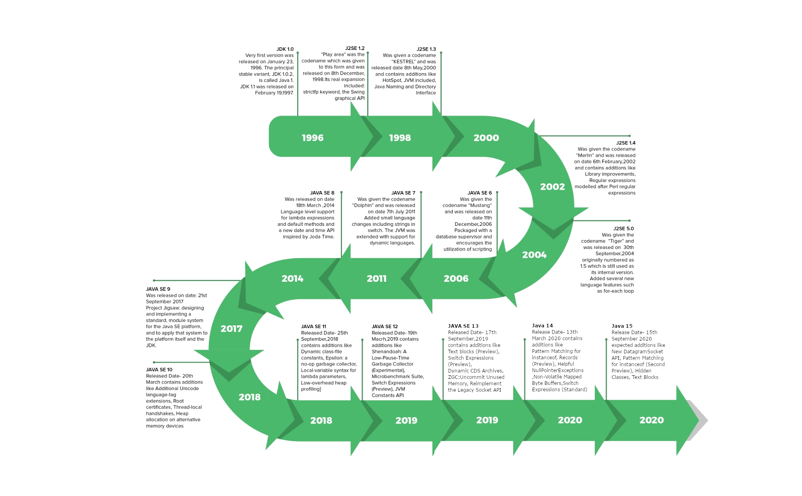
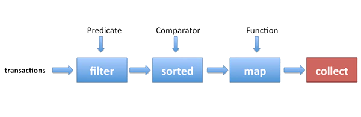

# **How Java has evolved through time**
 (and how we've not)

---
# What are we going to talk about
- Language improvements and its benefits
- API changes to adopt some improvements
<br>
- ~~Internal optimizations~~
- ~~Garbage collection estrategies~~
- ~~External libraries~~

---



### At a glance
---
###### Java 5: It's 2004
- Generics
- Annotations
- Autoboxing/unboxing
- Enhanced for loops
---
###### Java 5: Generics
```java
// Java 1.4
private ArrayList cart = new ArrayList();
list.add(new Product(1, 6));
list.add(new Product(8, 1));

Product p = (Product) cart.get(0);
```
```java
// Java 5
private ArrayList<Product> cart = new ArrayList<Product>();
list.add(new Product(1, 6));
list.add(new Product(8, 1));

Product p = cart.get(0);
```
---
###### Java 5: Annotations
```java
// Java 5
@SuppressWarnings(value = "unchecked")
void myMethod() { ... }
```

```java
// Java 5
@Entity
@Table(name = "PRODUCT")
public class Product { ... }
```
---
###### Java 5: Autoboxing/unboxing
```java
// Java 1.44
List<Integer> li = new ArrayList<Integer>();
for (int i = 1; i < 50; i += 2) {}
    li.add(Integer.valueOf(i));
}
```

```java
// Java 5
List<Integer> li = new ArrayList<Integer>();
for (int i = 1; i < 50; i += 2) {}
    li.add(i);
}
```
---
###### Java 5: Enhanced For loop
```java
// Java 1.4
int arr[]={2,11,45,9};

for(int i=0; i<arr.length; i++){
    System.out.println(arr[i]);
}
```
```java
// Java 5
int arr[]={2,11,45,9};

for (int num : arr) {
    System.out.println(num);
}
```
---
###### Java 6: It's 2006
- Improvements on many areas :
  - monitoring and instrumentation
  - networking
  - performance
  - reflection
  - RMI
  - security
  - serialization
- But no language improvements

---
###### Java 7: It's 2011
- Strings in switch Statements
- The try-with-resources Statement
- Type Inference for Generic Instance Creation
- Catching Multiple Exception Types
---
###### Java 7: Strings in switch Statements
```java
public String getTypeOfDayWithSwitchStatement(String dayOfWeekArg) {
     String typeOfDay;
     switch (dayOfWeekArg) {
         case "Monday":
             typeOfDay = "Start of work week";
             break;
         case "Tuesday":
         case "Wednesday":
         case "Thursday":
             typeOfDay = "Midweek";
             break;
         case "Friday":
             typeOfDay = "End of work week";
             break;
         case "Saturday":
         case "Sunday":
             typeOfDay = "Weekend";
             break;
         default:
             throw new IllegalArgumentException("Invalid day of the week: " + dayOfWeekArg);
     }
     return typeOfDay;
}
```

---
###### Java 7: The try-with-resources Statement

```java
// Java 6
static String readFirstLineFromFileWithFinallyBlock(String path) throws IOException {
  BufferedReader br = new BufferedReader(new FileReader(path));
  try {
    return br.readLine();
  } finally {
    if (br != null) br.close();
  }
}
```
```java
// Java 7
static String readFirstLineFromFile(String path) throws IOException {
  try (BufferedReader br = new BufferedReader(new FileReader(path))) {
    return br.readLine();
  }
}
```

---
###### Java 7: Type Inference for Generic Instance Creation


```java
// Java 6
Map<String, List<String>> myMap = new HashMap<String, List<String>>();
```
```java
// Java 7
Map<String, List<String>> myMap = new HashMap<>();
```


---

###### Java 7: Catching Multiple Exception Types


```java
// Java 6
catch (IOException ex) {
     logger.log(ex);
     throw ex;
catch (SQLException ex) {
     logger.log(ex);
     throw ex;
}
```
```java
// Java 7
catch (IOException|SQLException ex) {
     logger.log(ex);
     throw ex;
}
```

---
###### Java 8: It's 2014
- Lambda expressions
- Streams 
- Functional API
- Optional class


---

###### Java 8: lambda expressions
```java
@FunctionalInterface
interface MyFunctionalInterface {
  public String sayHello(String name);
}
```
[//]: # (Java 8 adds functional programming through what are called lambda  xpressions, which is a simple way of describing a function as some operation on an arbitrary set of supplied variables. All of the variables of the expression must be explicitly supplied; you don't access or store data that's not represented as a parameter. This makes lambda expressions more self-documenting, and the code is immune to hidden variables or states called side-effects. You can describe the transformation from input to output in lambda terms, and the details of transformations and recursions are hidden, which reduces complexity and errors. Lambda or functional language expressions can also facilitate parallelism because every variable is always represented as a parameter, so it follows you can run an expression anywhere and it will return the correct result if you give it the correct parameters. You can also split the lambda expression across several platforms and again get the same result. Lambda expressions add functional programming to Java 8, but the traditional imperative model is still available.)

---
###### Java 8: lambda expressions: functional interfaces
```java 
// Java 7
MyFunctionalInterface msg = new MyFunctionalInterface() {
  public String sayHello(String name) {
    return "Hello " + name;
  }
};
System.out.println(msg.sayHello("Lambda!"));
```

```java 
// Java 8: lambda expression
MyFunctionalInterface msg = (name) -> {
  return "Hello " + name;
};
System.out.println(msg.sayHello("Lambda!"));
```
---
###### Java 8: lambda expressions: functional interfaces
```java 
// Java 7
Arrays.sort(dogArray, new Comparator<Dog>() {
  @Override
  public int compare(Dog o1, Dog o2) {
    return o1.getWeight() - o2.getWeight();
  }
});
```
```java 
// Java 8
Arrays.sort(dogArray, (m, n) -> m.getWeight() - n.getWeight());
```
---
###### Java 8: lambda expressions: iterate list
```java 
// Java 7
public void iterateList(List<String> names) {
  for (String name : names) {
    System.out.println(iterator.next());
  }
}
```

```java 
// Java 8: lambda expression
public void iterateList(List<String> names) {
  // Iterable.forEach is added in JDK8 to take profit of lambda expressions
  names.forEach(name->System.out.println(name));
}
```

---
###### Java 8: Streams & Functional API
```java 
// Java 7
List<Transaction> groceryTransactions = new Arraylist<>(); 
for(Transaction t: transactions){  
  if(t.getType() == Transaction.GROCERY){   
    groceryTransactions.add(t);  
  } 
} 
Collections.sort(groceryTransactions, new Comparator(){  
  public int compare(Transaction t1, Transaction t2){   
    return t2.getValue().compareTo(t1.getValue());  
  } 
}); 
List<Integer> transactionIds = new ArrayList<>(); 
for(Transaction t: groceryTransactions){  
  transactionsIds.add(t.getId()); 
}
```
---
###### Java 8: Streams & Functional API
```java 
// Java 8
List<Integer> transactionsIds = transactions.stream()   
  .filter(t -> t.getType() == Transaction.GROCERY)   
  .sorted(comparing(Transaction::getValue).reversed())   
  .map(Transaction::getId)   
  .collect(toList());
```
<style>
img[alt~="center"] {
  display: block;
  margin: 0 auto;
}
</style>


---
###### Java 8: But also Parallel Streams
```java 
// Java 8
List<Integer> transactionsIds = transactions.parallelStream()   
  .filter(t -> t.getType() == Transaction.GROCERY)   
  .sorted(comparing(Transaction::getValue).reversed())   
  .map(Transaction::getId)   
  .collect(toList());
```
Just using *parallelStream()*  instead of *stream()*  we obtain the same result but taking profit of multiple CPU cores! (*)

<br>
<br>
<br>
(*) multithreading is not granted on all conditions


---
###### Java 8: Optional class
```java 
// Java 7
String result = this.buildResult();
if (result == null) {
    return "n/a";
}

return result.toUpperCase();
```

```java 
// Java 8
return Optional.ofNullable(buildResult())
               .map(String::toUpperCase)
               .orElse("n/a");
```
---
###### Java 8: Optional class
```java 
// Java 7
String version = "UNKNOWN";
if(computer != null){
  Soundcard soundcard = computer.getSoundcard();
  if(soundcard != null){
    USB usb = soundcard.getUSB();
    if(usb != null){
      version = usb.getVersion();
    }
  }
}
// Java 8
String version = computer.flatMap(Computer::getSoundcard)
                        .flatMap(Soundcard::getUSB)
                        .map(USB::getVersion)
                        .orElse("UNKNOWN");
```
---

###### Java 9: Convenience Factory Methods for Collections
```java 
// Java 8
Set<String> set = new HashSet<>();
set.add("a");
set.add("b");
set.add("c");
set = Collections.unmodifiableSet(set);
```

```java 
// Java 9
Set<String> set = Set.of("a", "b", "c");
```
---
###### Java 10: Local Variable Type Inference
```java 
// Java 9
public void method() {
  Map<String, String> map = new HashMap<>();
  map.put("APL", "Apple");
  map.put("SMG", "Samsung");
  map.forEach((k,v)-> System.out.println(k + " " + v));
}
```
```java 
// Java 10
public void method() {
  var map = new HashMap<>();
  map.put("APL", "Apple");
  map.put("SMG", "Samsung");
  map.forEach((k,v)-> System.out.println(k + " " + v));
}
```
---
###### Java 10: APIs for Creating Unmodifiable Collections

java.util.List:	
```<E> List<E> copyOf(Collection<? extends E> coll)```
java.util.Set:	
```<E> Set<E> copyOf(Collection<? extends E> coll)```
java.util.Map:	
```<K,V> Map<K,V> copyOf(Map<? extends K, ? extends V> coll)```

- Shallow copy
- Attempting to modify it (adding/removing new elements) throws UnsupportedOperationException

---
###### Java 10: APIs for Creating Unmodifiable Collections
```java 
// Diference with Collections.unmodifiableList 
public class WithCollectionsUtilExample {
  public static void main(String[] args) {
      List<Integer> list = new ArrayList<>();
      list.add(1);
      list.add(2);
      List<Number> unmodifiableList = Collections.unmodifiableList(list);
      List<Integer> copyOfList = List.copyOf(list);
      //modifying the source list
      list.add(3);
      System.out.println("unmodifiableList: " + unmodifiableList);
      System.out.println("copyOfList: " + copyOfList);
  }
}
// unmodifiableList: [1, 2, 3] 
// copyOfList: [1, 2]
```
---
###### Java 10: Inmutable/Unmodifiable Collections Stream API Collectors
```java 
// Java 9
var unmodifiableList = Stream.of(42, 30, 20, 10)
  .collect(Collectors.collectingAndThen(Collectors.toList(), Collections::unmodifiableList));
```

```java 
// Java 10
var unmodifiableList = Stream.of(42, 30, 20, 10)
  .collect(Collectors.toUnmodifiableList());
```
---
###### Java 11: Main Features
- LTS version
- Oracle JDK is no longer free for commercial use
- New utility methods in String class
- Local-Variable Syntax for Lambda Parameters
- Reading/Writing Strings to and from the Files
- JEP 321: HTTP Client


---

```java 
// Java 10

```
```java 
// Java 11

```
---


